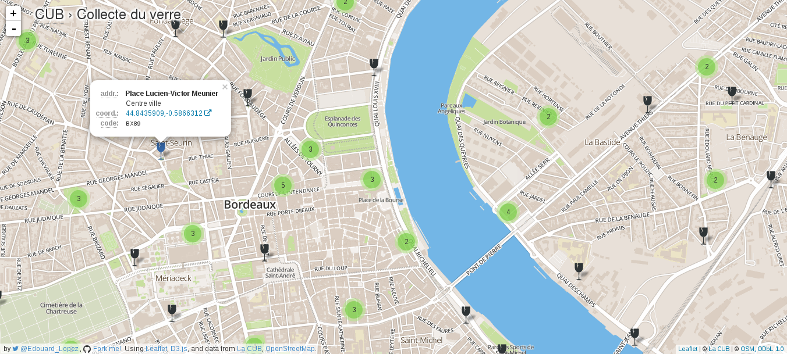

# Dataviz CUB: point d'apports volontaires

Dataviz project to visualize different type of trash collecting point



## Data Sources

* geo-location come from [official Gironde Open Data portal](http://www.datalocale.fr/dataset/en_empac_p) ;
* adress from the [http://ourecycler.fr/point-collecte/33800/Bordeaux](Ourecycler.fr) website.


# Install

Start by cloning the project repository:
```bash
git clone https://github.com/edouard-lopez/dataviz-cub-pav.git
cd dataviz-cub-pav
```
And install some tooling:
```bash
npm install -g yo bower grunt-cli gulp topojson
```

# Getting started

Install project dependecy using `npm` and `bower`:
```bash
npm install
bower install
```
Run a preview with `gulp`:
```bash
gulp serve
```
Start playing !

## Want to scaffold a similar project ?

### Tools: GDAL (Geospatial Data Abstraction Library)

To manipulate Shapefile, you need to have [`ogr2ogr`](http://www.gdal.org/ogr2ogr.html) command line, install [GDAL library](http://www.gdal.org/) for that:
```bash
sudo apt-get install gdal-bin
```

### JavaScript Libraries


So start by installing [Gulp webapp generator](https://www.npmjs.org/package/generator-gulp-webapp) for `yeoman`:
```bash
sudo npm install -g generator-gulp-webapp gulp
```

Continue by scaffolding the application with the `yeoman`'s generator:
```bash
mkdir my-map-app && cd my-map-app
yo gulp-webapp
```
Then install others dependencies:

* I'm using [LeafletJS for interactive map](http://leafletjs.com/) ;
* and [`d3.js` for the dataviz](http://d3js.org/).

```bash
npm install --save-dev jq xml2json-command topojson generator-gulp-webapp gulp gulp-sass
bower install --save topojson font-awesome d3 d3-plugins
```

Finish by running `gulp` for building and gulp watch for preview :
```bash
gulp watch
```

### License

Project under [GPLv3 license](http://choosealicense.com/licenses/gpl-3.0/).